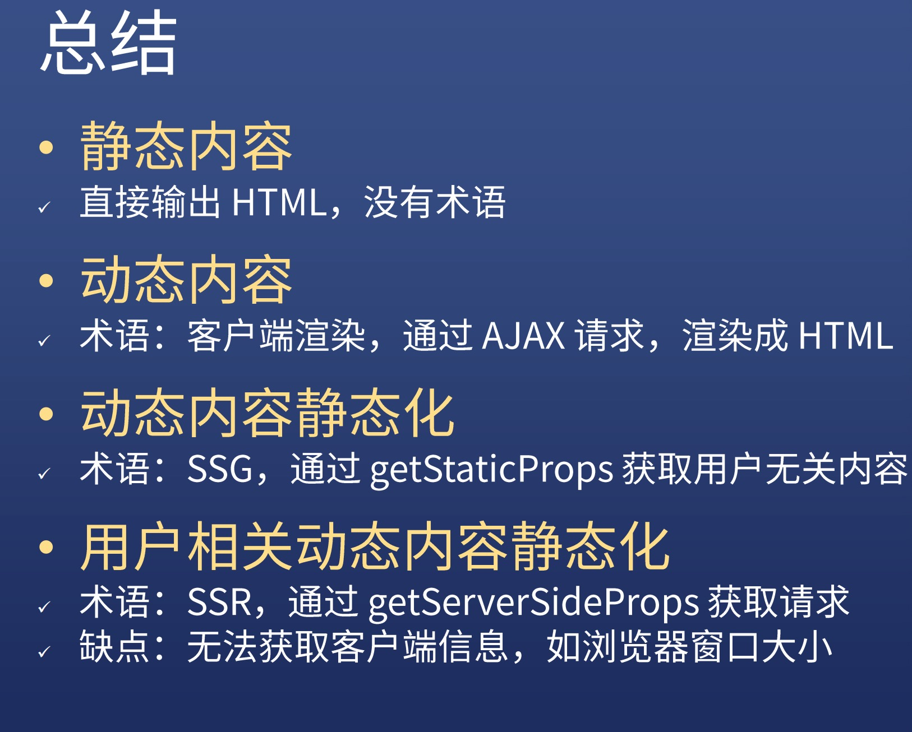

## 客户端渲染（BSR）
### 1.数据一开始不在页面上，是由客户端ajax请求数据渲染而来
### 2.静态内容是服务器渲染的
### 3.点击事件发生是由前端渲染的，不然的话还要去和后端要，而事实上不是，所以是由前端渲染的
### 4.后端渲染HTML，前端添加监听，
### 5.前端也会渲染一次，用以确保后端渲染结果一致

## 静态页面生成（SSG）---》动态内容静态化
#### 注意：静态内容就是后端服务器生成的，动态内容就是前端浏览器生成的
### 前端也可以拿到数据，通过script 的 id=__NEXT_DATA__ type="aplication/json"拿到数据

## 用户相关动态内容较难提前静态化

